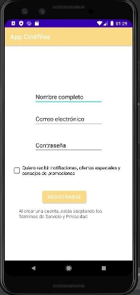
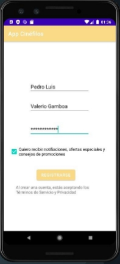
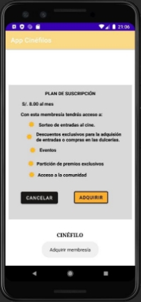
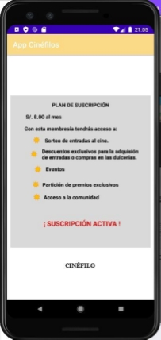
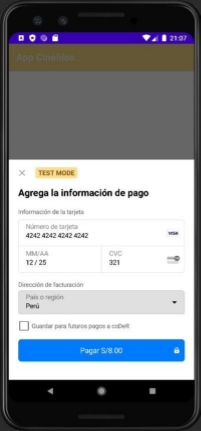
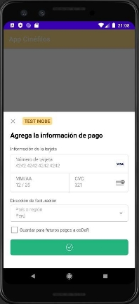

**Pruebas de Funcionamiento de la App**

- **Flujo de login
  En este proceso el usuario ya está registrado y ha ingresado con su cuenta con la cual podrá visualizar su preferencias en películas y sus datos correspondientes en la interfaz ver perfil**

- **Flujo de registrar usuario**

			****

- **Flujo de Buscar Película**

**

- **Flujo de Pasarela de Pago Stripe**

El usuario podrá adquirir el programa que ofrece nuestra aplicación como acceso a ciertos productos o servicios a cambio de un pago periódico.

   **  **

Luego de adquirir el Plan Automático el sistema lo agrega como miembro al programa de servicios premium, mostrando el mensaje de “SUSCRIPCIÓN ACTIVA”, esto hasta que pueda desafiliarse si el cliente no desea más dicho servicio.

**Registro en el dashboard**

Podemos visualizar los pagos registrados a través de la pasarela de pagos Stripe, para ello tenemos que acceder al siguiente enlace https://dashboard.stripe.com/test/payments , para acceder iniciamos sesión con nuestra cuenta registrada.

